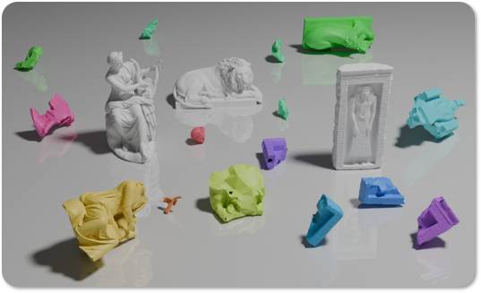
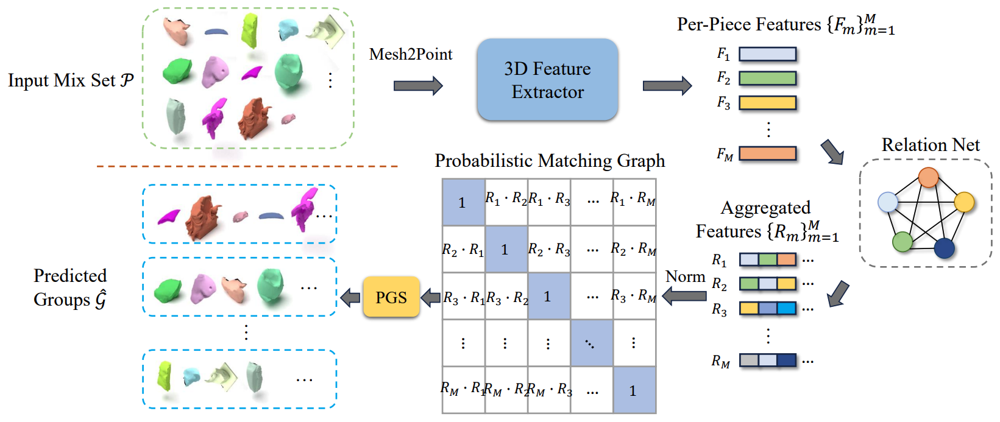

# [AAAI 2025] 3DPGS: 3D Probabilistic Graph Search for Archaeological Piece Grouping

Authors: Junfeng Cheng, Yingkai Yang and Tania Stathaki  
Paper link: https://ojs.aaai.org/index.php/AAAI/article/view/32246/34401
-
<div align="center">
  
</div>

## Introduction
This repository contains the code and datasets for the paper “3DPGS: 3D Probabilistic Graph Search for Archaeological Piece Grouping.” The paper introduces a new dataset called ArcPie for the archaeological 3D grouping task. In addition, it presents a new algorithm, 3DPGS, which achieves state-of-the-art performance.
<div align="center">
  
</div>

## Requirements
```
conda env create -f environment.yml
conda activate 3dpgs
```

## Usage
### Training
```
bash scripts/train.sh
```

### Evaluation
```
bash scripts/eval.sh
```

## ToDo
- [x] Release training code
- [x] Release evaluation code
- [x] Upload pretrained models
- [ ] Upload dataset
- [ ] Add rendering code

## Citation
If you find this code useful for your research, please consider citing:
```
@inproceedings{cheng20253dpgs,
  title={3DPGS: 3D Probabilistic Graph Search for Archaeological Piece Grouping},
  author={Cheng, Junfeng and Yang, Yingkai and Stathaki, Tania},
  booktitle={Proceedings of the AAAI Conference on Artificial Intelligence},
  volume={39},
  number={3},
  pages={2447--2454},
  year={2025}
}
```

## Acknowledgement
This project is built upon [G-FARS](https://github.com/J-F-Cheng/G-FARS-3DPartGrouping).

Besides, we want to express our gratitude to the following great works:
- [PartNet](https://partnet.cs.stanford.edu/)
- [Generative 3D Part Assembly via Dynamic Graph Learning](https://hyperplane-lab.github.io/Generative-3D-Part-Assembly/)
- [Mitsuba](https://www.mitsuba-renderer.org/)
- [PointFlowRenderer](https://github.com/zekunhao1995/PointFlowRenderer)

